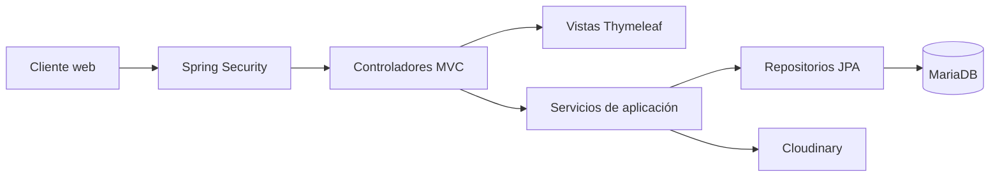

# Travel Agency Backend Template

Plantilla base para aplicaciones web de agencias de viajes desarrolladas con Spring Boot, Spring MVC, Thymeleaf, Spring Security y MariaDB.

El proyecto proporciona una arquitectura inicial para autenticación, administración de usuarios, gestión de paquetes turísticos e integración de imágenes con Cloudinary. Está diseñado como una aplicación web renderizada en el servidor; no expone una API REST como contrato principal.

## Propiedad intelectual

Copyright © 2026 Codeboost. Todos los derechos reservados.

Este repositorio y su contenido son propiedad de Codeboost. No se concede autorización para copiar, redistribuir, sublicenciar, vender o utilizar comercialmente el código, total o parcialmente, sin autorización previa y por escrito de Codeboost.

La publicación del código en un repositorio de GitHub no implica que sea software de dominio público ni que se otorgue una licencia de código abierto. Las contribuciones, modificaciones y distribuciones deben contar con autorización expresa de Codeboost.

## Funcionalidad actual

- Registro e inicio de sesión mediante formularios MVC.
- Autenticación basada en sesión con Spring Security.
- Roles `ROLE_USER` y `ROLE_ADMIN`.
- Contraseñas protegidas con BCrypt.
- Opción de sesión persistente mediante `remember-me`.
- Administración de usuarios.
- Administración de paquetes turísticos.
- Activación y desactivación lógica de usuarios y paquetes.
- Carga y eliminación de imágenes mediante Cloudinary.
- Persistencia con Spring Data JPA y MariaDB.
- Configuración sensible mediante variables de entorno.

## Tecnologías

- Java 21
- Spring Boot 3.3.0
- Spring MVC
- Thymeleaf y Thymeleaf Extras para Spring Security
- Spring Security 6
- Spring Data JPA / Hibernate
- MariaDB JDBC
- Cloudinary Java SDK 1.38.0
- Maven Wrapper
- JUnit 5 y Spring Security Test

## Arquitectura

La aplicación utiliza una arquitectura por capas. Cada capa mantiene una responsabilidad concreta y depende únicamente de las capas interiores necesarias.



### Capa de presentación

Los controladores reciben solicitudes HTTP, validan datos propios del flujo web, agregan información al modelo y seleccionan una vista o redirección. Los formularios usan `application/x-www-form-urlencoded` o `multipart/form-data`; no deben interpretarse como endpoints JSON.

### Capa de seguridad

`SecurityConfig` define autenticación, autorización por roles, CSRF, cierre de sesión, cookies y `remember-me`. `CustomUserDetailsService` obtiene los usuarios desde la base de datos para el proceso de autenticación.

### Capa de servicios

Las interfaces de servicio representan los casos de uso de usuarios, paquetes e imágenes. Sus implementaciones contienen las reglas de negocio y delimitan las transacciones.

### Capa de persistencia

Los repositorios extienden `JpaRepository` y trabajan con las entidades `Usuario` y `Paquete`. Hibernate administra el mapeo entre los modelos Java y MariaDB.

### Integraciones externas

La configuración de Cloudinary crea un cliente a partir de `CLOUDINARY_URL`. Las credenciales nunca deben escribirse en el código fuente ni registrarse en logs.

## Estructura principal

```text
src/main/java/com/codeboost/travel_agency_backend_template/
├── config/          Configuración de seguridad e integraciones
├── controller/      Controladores Spring MVC
├── domain/model/    Entidades JPA
├── repository/      Acceso a datos con Spring Data JPA
├── security/        Integración de usuarios con Spring Security
└── service/         Interfaces y reglas de negocio

src/main/resources/
├── application.properties
├── templates/       Vistas Thymeleaf esperadas
└── static/          CSS, JavaScript e imágenes públicas
```

> Estado actual: los controladores ya declaran las vistas Thymeleaf, pero las carpetas `templates/` y `static/` no están incluidas todavía en esta plantilla. Deben añadirse antes de probar los flujos visuales de login, registro, inicio y administración.

## Rutas MVC principales

| Método | Ruta | Acceso | Descripción |
|---|---|---|---|
| `GET` | `/` | Público | Página principal y paquetes activos |
| `GET` | `/privacidad` | Público | Aviso de privacidad |
| `GET` | `/login` | Público | Formulario de inicio de sesión |
| `POST` | `/login` | Público | Procesamiento de Spring Security |
| `GET` | `/registro` | Público | Formulario de registro |
| `POST` | `/registro` | Público | Creación de una cuenta |
| `GET` | `/dashboard` | Administrador | Resumen administrativo |
| `GET/POST` | `/dashboard/usuarios/**` | Administrador | Gestión de usuarios |
| `GET/POST` | `/dashboard/paquetes/**` | Administrador | Gestión de paquetes |

Los formularios `POST` están protegidos con CSRF. El resultado habitual es una redirección HTTP, no una respuesta JSON.

## Requisitos

- JDK 21
- Acceso a una instancia MariaDB/MySQL compatible
- Cuenta de Cloudinary para las operaciones de imágenes
- Puerto `8080` disponible

No es necesario instalar Maven globalmente porque el proyecto incluye Maven Wrapper.

## Configuración local

1. Copia `.env.example` como `.env.local`.
2. Sustituye todos los valores de ejemplo por credenciales locales válidas.
3. Mantén `.env.local` fuera del control de versiones.

Variables principales:

| Variable | Obligatoria | Propósito |
|---|---:|---|
| `DB_HOST` | Sí | Host público o interno de MariaDB |
| `DB_PORT` | Sí | Puerto de la base de datos |
| `DB_NAME` | Sí | Nombre de la base de datos |
| `DB_USERNAME` | Sí | Usuario de conexión |
| `DB_PASSWORD` | Sí | Contraseña de conexión |
| `DB_USE_SSL` | Sí | Habilita TLS para JDBC |
| `DB_ALLOW_PUBLIC_KEY_RETRIEVAL` | Sí | Controla la recuperación de clave pública |
| `JPA_DDL_AUTO` | Sí | Estrategia de validación o actualización del esquema |
| `APP_REMEMBER_ME_KEY` | Sí | Secreto aleatorio para cookies `remember-me` |
| `SESSION_COOKIE_SECURE` | Sí | Restringe cookies a HTTPS |
| `CLOUDINARY_URL` | Sí | URL privada de conexión con Cloudinary |
| `APP_SEED_ENABLED` | No | Habilita datos locales de prueba |
| `APP_SEED_EMAIL` | No | Correo del usuario local de prueba |
| `APP_SEED_PASSWORD` | No | Contraseña del usuario local de prueba |

No publiques `.env.local`, capturas con credenciales, archivos de configuración del IDE ni secretos en logs. Si una credencial se expone, debe rotarse.

## Ejecución

En Windows:

```powershell
.\mvnw.cmd spring-boot:run
```

En Linux o macOS:

```bash
./mvnw spring-boot:run
```

La aplicación queda disponible en:

```text
http://localhost:8080
```

Para activar explícitamente el perfil local:

```powershell
.\mvnw.cmd spring-boot:run -Dspring-boot.run.profiles=local
```

## Compilación y pruebas

Ejecutar pruebas:

```powershell
.\mvnw.cmd test
```

Crear el artefacto ejecutable:

```powershell
.\mvnw.cmd clean package
```

El archivo generado se encuentra en `target/`.

Las pruebas automatizadas deben cubrir, como mínimo:

- Login correcto e incorrecto.
- Acceso anónimo y autorización por roles.
- Protección CSRF de formularios.
- Registro y validación de usuarios.
- Operaciones CRUD de paquetes.
- Fallos controlados de MariaDB y Cloudinary.

## Seguridad y despliegue

- Usa `JPA_DDL_AUTO=update` solamente en desarrollo controlado. En producción utiliza `validate` y migraciones versionadas con Flyway o Liquibase.
- Mantén `DB_USE_SSL=true` y `SESSION_COOKIE_SECURE=true` en producción.
- Genera `APP_REMEMBER_ME_KEY` con al menos 32 bytes aleatorios.
- No uses usuarios administradores de prueba en producción.
- Limita los permisos del usuario de base de datos al mínimo necesario.
- Rota periódicamente las credenciales de MariaDB y Cloudinary.
- Ejecuta análisis de dependencias, pruebas y escaneo de secretos antes de publicar cambios.

## Alcance de la plantilla

Este repositorio ofrece una base reutilizable y requiere adaptación antes de utilizarse en un proyecto productivo. Cada implementación debe completar las vistas, agregar migraciones, pruebas de integración, observabilidad, manejo global de errores y controles específicos del negocio de la agencia.

---

Desarrollado y mantenido por **Codeboost**.
